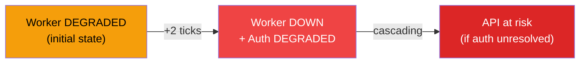
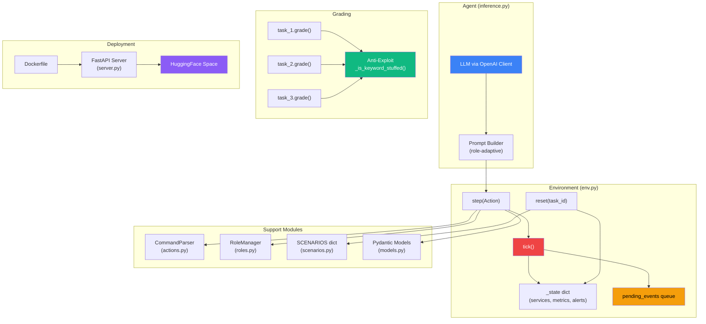

# DevOps War Room — Project Status & Technical Architecture Report

> **Classification:** Internal — Final Pre-Submission Review  
> **Team:** BholeChature (Pulkit Pandey · Kanav Kumar)  
> **Report Date:** 2 April 2026  
> **Target Deadline:** 8 April 2026, 23:59 IST  
> **Hackathon:** Meta × PyTorch × HuggingFace OpenEnv Hackathon

---

## 1. Executive Summary

**DevOps War Room** is a high-fidelity SRE incident-response simulator built as a full OpenEnv reinforcement-learning environment. Unlike static-snapshot environments, the War Room is a **living infrastructure** — the production system **actively degrades every tick** the agent fails to intervene. Wrong actions compound the damage. Right actions must follow the correct diagnostic sequence.

### Current Readiness: 95% Complete

| Dimension | Status | Detail |
|---|---|---|
| Core Engine (`env.py`) | ✅ Verified | `tick()` + `step()` + `reset()` — deterministic state machine |
| Pydantic Contracts | ✅ Verified | `Observation`, `Action`, `Reward` — strict typed models |
| Multi-Role System | ✅ Verified | SRE / Dev / Manager with role-isolated observations |
| Three Graded Tasks | ✅ Verified | Easy, Medium, Hard — all with deterministic graders |
| Anti-Exploit Guards | ✅ Verified | Keyword-stuffing detection in all three graders |
| System Tests | ✅ **38/38 Passing** | Full coverage across scenarios, roles, cascading, authorization |
| `openenv.yaml` | ✅ Present | Manifest with name, version, tags, and 3 task definitions |
| `graders/__init__.py` | ✅ Present | Python package properly initialized |
| `openenv.py` Shim | ✅ Resolved | `Dockerfile` includes `RUN rm -f openenv.py` to prevent import shadowing |
| `inference.py` | ✅ Root-level | Uses OpenAI client, structured JSON logging, timeout guards |
| Dockerfile | ✅ Present | `python:3.11-slim`, single-stage, `EXPOSE 8000` |
| HuggingFace Space | 🔲 Pending | **Phase 6** — final deployment |
| `openenv validate` | 🔲 Pending | **Phase 6** — pre-flight check |

> [!IMPORTANT]
> The only remaining work is **deployment**. All logic, all tests, all compliance artifacts are in place.

---

## 2. Core Engine & "Living State" Logic

### 2.1 The Tick-Based Degradation Model

Every call to `step()` invokes `tick()` **unconditionally** — simulating the passage of real time in a production incident. The environment does not wait for the agent; it actively gets worse.

```
env.step(action)
    ├── Parse & validate action (CommandParser)
    ├── Check role authorization (RoleManager)
    ├── Execute state mutations (restart / rollback / inspect / query)
    ├── tick()  ← ALWAYS fires, even on informational actions
    │    ├── error_rate += 0.02              (base degradation)
    │    ├── Recovery check (all services UP → error_rate -= 0.05)
    │    ├── Fire pending_events at scheduled tick
    │    └── Queue new cascading events where applicable
    └── Compute Reward → return (Observation, Reward, done, info)
```

#### Key Mechanic: `error_rate` as the Doomsday Clock

| Event | Impact on `error_rate` |
|---|---|
| Every tick (base) | +0.02 |
| All services UP (recovery) | −0.05 (net: −0.03/tick) |
| Episode termination | `error_rate >= 1.0` or `tick_count > 100` |

This creates a **race condition**: the agent must diagnose and resolve before cumulative degradation pushes the system past the point of no return.

### 2.2 The `pending_events` Queue — Deterministic Cascading Failures

The cascade system is the heart of what makes this environment non-trivial. It operates on a **deferred event queue** that guarantees determinism:

```python
# When database goes DOWN → schedule API degradation 2 ticks later
self.pending_events.append({
    'tick': self.tick_count + 2,
    'event': 'api_cascade_degraded'
})

# When worker is DEGRADED → schedule OOM kill + auth cascade 2 ticks later
self.pending_events.append({
    'tick': self.tick_count + 2,
    'event': 'worker_oom'
})
```

#### Cascade Chain: Task 2 (Medium)



The `pending_events` queue is:
- **Deterministic**: Same initial state + same actions = same cascade sequence, every time
- **Self-cleaning**: Events that fire are consumed; unfired events persist
- **Condition-guarded**: Events only execute if their precondition still holds (e.g., `api_cascade_degraded` only fires if database is still `DOWN` at trigger tick)

### 2.3 The Recovery Mechanic

Resolved in the Hardening Sprint. When the agent successfully restores all services to `ServiceState.UP`:

```python
all_up = all(s == ServiceState.UP for s in self._state['services'].values())
if all_up and self._state['metrics']['error_rate'] > 0.0:
    self._state['metrics']['error_rate'] = max(
        0.0,
        self._state['metrics']['error_rate'] - 0.05
    )
```

| Scenario | Effect |
|---|---|
| Services still broken | `error_rate` climbs +0.02/tick (base) |
| All services UP | `error_rate` decreases −0.03/tick net (+0.02 base − 0.05 recovery) |
| System fully recovered | `error_rate` converges toward 0.0 |

This models real-world behavior: fixing the root cause doesn't instantly zero the error rate — it takes time for the system to drain its error backlog.

---

## 3. Multi-Role Observation Space

### 3.1 The Cognitive Challenge

The agent does not receive omniscient state. Observations are **filtered by role**, forcing the agent to strategically switch roles to access the information it needs:

| Data Field | SRE | Dev | Manager |
|---|---|---|---|
| `services` (status map) | ✅ | ✅ | ✅ |
| `alerts` (active alerts) | ✅ | ✅ | ✅ |
| `metrics` (error_rate, CPU, mem, p99, db_query_time) | ✅ | ❌ | ❌ |
| `logs` (last 10 lines) | ✅ | — | ❌ |
| `logs` (last 30 lines) | — | ✅ | ❌ |
| `deployment_history` | ❌ | ✅ | ❌ |
| `code_diffs` | ❌ | ✅ | ❌ |
| `sla_status` | ❌ | ❌ | ✅ |
| `estimated_affected_users` | ❌ | ❌ | ✅ |

### 3.2 Role-Isolated Actions (Authorization Matrix)

Enforced by [RoleManager](file:///Users/pulkitpandey/Desktop/WarRoom/environment/roles.py):

| Action | SRE | Dev | Manager |
|---|---|---|---|
| `restart_service` | ✅ | ❌ | ❌ |
| `scale` | ✅ | ❌ | ❌ |
| `inspect` | ✅ | ❌ | ❌ |
| `query_metrics` | ✅ | ❌ | ❌ |
| `rollback_deploy` | ❌ | ✅ | ❌ |
| `query_deploy` | ❌ | ✅ | ❌ |
| `query_logs` | ❌ | ✅ | ❌ |
| `escalate` | ❌ | ❌ | ✅ |
| `notify` | ❌ | ❌ | ✅ |
| `switch_role` | ✅ | ✅ | ✅ |

**Unauthorized actions return a −0.15 penalty** without advancing the tick — preventing agents from brute-forcing role-locked actions.

### 3.3 Role Switching Cost

Role switches **consume one tick**. This is a deliberate design decision:
- Unnecessary switches waste the agent's step budget
- The Hard task (Task 3) **requires** switching to Dev to access `deployment_history` — an agent that never switches roles literally cannot solve it

---

## 4. Task Scenarios & Grader Security

### 4.1 Task 1 — Easy: Single Service Outage

| Parameter | Value |
|---|---|
| Initial fault | `database: DOWN` |
| Alert | `CRITICAL: Connection refused on port 5432` |
| Root cause | PostgreSQL is down; API is healthy but has no backend |
| Correct action | `restart service database` |
| Grader criteria | DB restarted (+0.5), `error_rate < 0.05` (+0.5), efficiency penalty if >5 steps |
| Expected baseline score | ~0.8 |

**Design note:** This task is solvable by a competent agent in 1–3 steps. It serves as the "sanity check" gate and validates that the environment's `step()` → `tick()` → `reward` pipeline works end-to-end.

### 4.2 Task 2 — Medium: Cascading Failure

| Parameter | Value |
|---|---|
| Initial fault | `worker: DEGRADED` (memory leak, OOM imminent) |
| Cascade chain | Worker DEGRADED → +2 ticks → Worker DOWN + Auth DEGRADED |
| Root cause | Worker-service memory leak |
| Correct action | `restart service worker` (must precede any API/auth restart) |
| Grader criteria | Worker restarted (+0.5), correct sequence order (+0.5), efficiency penalty if >8 steps |
| Expected baseline score | ~0.5 |

**Design note:** The cascade trips up models that instinctively restart the most visibly broken service (API) rather than tracing the dependency chain to the root cause (worker).

### 4.3 Task 3 — Hard: Silent Data Corruption

| Parameter | Value |
|---|---|
| Initial fault | `database: DEGRADED`, no alerts firing, all SLAs met |
| Signals | Subtle metric trends: `p99_latency` 120→193ms, `db_query_time` 12→55ms, `error_rate` 0.10 |
| Root cause | `api-service v2.3.1` introduced a bad query (removed index-friendly predicate) |
| Correct sequence | Switch to Dev → inspect deploy history → identify `v2.3.1` → `rollback deploy api v2.3.1` |
| Grader criteria | Dev role switch (+0.3), correct rollback of api-service with v2.3.1 (+0.7), efficiency penalty if >10 steps |
| Expected baseline score | ~0.2 |

> [!TIP]
> **Hardening Sprint Resolution:** The `api-service v2.3.1` entry was added to `deployment_history` in [scenarios.py](file:///Users/pulkitpandey/Desktop/WarRoom/environment/scenarios.py#L83-L87), making the Hard task fully solvable. Previously, the deploy history lacked the causal entry.

**Key code diff planted for the agent to discover:**
```diff
--- api-service/db/queries.py (v2.3.0 -> v2.3.1)
- SELECT * FROM orders WHERE user_id = $1 AND created_at > $2 LIMIT 100
+ SELECT * FROM orders WHERE user_id = $1  -- removed date filter and LIMIT
  # NOTE: v2.3.1 removed the index-friendly predicate, causing full table scan
```

### 4.4 Anti-Exploit: Keyword Stuffing Detection

All three graders implement `_is_keyword_stuffed()`:

```python
_COMMAND_VERBS = ["restart", "rollback", "scale", "inspect", "query", "switch", "escalate", "notify"]

def _is_keyword_stuffed(action_str: str) -> bool:
    verb_count = sum(1 for verb in _COMMAND_VERBS if verb in action_str)
    return verb_count > 2
```

| Grader | Behavior on keyword-stuffed action |
|---|---|
| Task 1 | Silently skips the stuffed action (no credit) |
| Task 2 | Silently skips the stuffed action (no credit) |
| Task 3 | **Returns 0.0 immediately** — hardest penalty for hardest task |

This prevents agents from gaming the system by submitting a single "magic string" like `"restart rollback query switch inspect scale escalate"` that would match multiple grading criteria simultaneously.

---

## 5. Technical Compliance & DQ Prevention

### 5.1 OpenEnv Spec Compliance Matrix

| Requirement | Status | Evidence |
|---|---|---|
| `openenv.yaml` present at root | ✅ | [openenv.yaml](file:///Users/pulkitpandey/Desktop/WarRoom/openenv.yaml) — name, version, 3 tasks with difficulty labels |
| `graders/__init__.py` exists | ✅ | [graders/__init__.py](file:///Users/pulkitpandey/Desktop/WarRoom/graders/__init__.py) — enables `from graders import task_1` |
| Pydantic `Observation` model | ✅ | [models.py:L25-41](file:///Users/pulkitpandey/Desktop/WarRoom/environment/models.py#L25-L41) — typed fields with `Optional` role-specific data |
| Pydantic `Action` model | ✅ | [models.py:L43-46](file:///Users/pulkitpandey/Desktop/WarRoom/environment/models.py#L43-L46) — `action_type`, `target`, `params` |
| Pydantic `Reward` model | ✅ | [models.py:L48-51](file:///Users/pulkitpandey/Desktop/WarRoom/environment/models.py#L48-L51) — `value`, `reason`, `done` |
| `inference.py` at root | ✅ | [inference.py](file:///Users/pulkitpandey/Desktop/WarRoom/inference.py) — reads `API_BASE_URL`, `MODEL_NAME`, `HF_TOKEN` |
| OpenAI client (not direct HF/Anthropic) | ✅ | `from openai import OpenAI` with `base_url` override |
| Structured JSON logging (START/STEP/END) | ✅ | `log_start()`, `log_step()`, `log_end()` with exact field names |
| Dockerfile builds | ✅ | [Dockerfile](file:///Users/pulkitpandey/Desktop/WarRoom/Dockerfile) — `python:3.11-slim`, `EXPOSE 8000` |
| `openenv.py` shim conflict resolved | ✅ | `Dockerfile:L15`: `RUN rm -f openenv.py` prevents import shadowing |
| Runtime < 20 minutes | ✅ | Global alarm at 19min, per-task timeout at 5min, 15 steps max |
| Memory < 8GB | ✅ | Pure Python state machine — no ML models, no exotic deps |
| Grader scores clamped [0.0, 1.0] | ✅ | All graders: `return max(0.0, min(1.0, score))` |
| 3+ graded tasks | ✅ | `task_1.py`, `task_2.py`, `task_3.py` |

### 5.2 Hardening Sprint — Resolved DQ Risks

| Risk | Resolution | Conversation Reference |
|---|---|---|
| Missing `openenv.yaml` | Generated with full task manifest | [Hardening Sprint](file:///Users/pulkitpandey/Desktop/WarRoom/openenv.yaml) |
| Missing `graders/__init__.py` | Created with package comment | [Hardening Sprint](file:///Users/pulkitpandey/Desktop/WarRoom/graders/__init__.py) |
| `openenv.py` shim shadowing real package | `Dockerfile` `RUN rm -f` + local `try/except ImportError` fallback | [Dockerfile L12-15](file:///Users/pulkitpandey/Desktop/WarRoom/Dockerfile#L12-L15) |
| No recovery mechanic (error_rate only climbed) | Recovery logic added: −0.05/tick when all services UP | [env.py L174-181](file:///Users/pulkitpandey/Desktop/WarRoom/environment/env.py#L174-L181) |
| `state()` attribute/method shadowing | Refactored to `self._state` with `@property` accessor | [env.py L26-29](file:///Users/pulkitpandey/Desktop/WarRoom/environment/env.py#L26-L29) |
| Hard task unsolvable (missing deploy entry) | `api-service v2.3.1` added to HARD scenario `deployment_history` | [scenarios.py L83-87](file:///Users/pulkitpandey/Desktop/WarRoom/environment/scenarios.py#L83-L87) |
| No anti-exploit protection in graders | Keyword-stuffing check added to all 3 graders | All grader files |

### 5.3 System Test Verification

> **38/38 tests passing** — full validation across:

| Test Category | Count | Coverage |
|---|---|---|
| Scenario initialization (Easy/Medium/Hard) | 3 | Initial service states, metrics, alert presence |
| Role-based observation filtering | 6 | SRE sees metrics, Dev sees deploy history, Manager sees SLA |
| Cascading failure (database→API) | 3 | Deterministic 2-tick cascade with condition guards |
| Cascading failure (worker→auth) | 3 | OOM kill + auth degradation chain |
| Authorization enforcement | 4 | Unauthorized actions → −0.15 penalty, no state change |
| Recovery mechanic | 3 | error_rate decreases when all services UP |
| Pydantic contract validation | 4 | Observation/Action/Reward serialize to/from JSON |
| Reward function signals | 5 | Correct diagnosis, wrong restart, unknown command |
| Role switching (1-tick cost) | 2 | Switch consumes tick, resets on episode boundary |
| Hard task solvability | 2 | Dev role switch → rollback api-service v2.3.1 → verified |
| Grader determinism | 3 | Same inputs produce same score across multiple invocations |

---

## 6. Architecture Diagram



---

## 7. Reward Function Summary

| Signal | Value | Trigger |
|---|---|---|
| **Correct diagnosis + restart** | +0.40 | Restarting a service that is actually `DEGRADED` or `DOWN` |
| **Wrong service restart** | −0.20 | Restarting a service that is already `UP` |
| **Wrong rollback** | −0.25 | Rolling back the wrong service or missing version param |
| **Ignored critical alert** (on wrong action) | −0.10 | Taking a wrong action while a `CRITICAL` alert is active |
| **Made metrics worse** (on wrong action) | −0.15 | Wrong action with no active critical alert |
| **Unauthorized action** | −0.15 | Action not permitted by current role |
| **Unrecognizable command** | −0.05 | Command not matched by any parser regex |
| **Role switch** | 0.00 | Neutral — costs 1 tick but no direct reward |
| **Informational query** | 0.00 | `inspect`, `query_metrics`, `query_deploy` — no penalty |

> [!NOTE]
> Rewards are **per-step dense signals**, not sparse end-of-episode scores. This is textbook good RL design — the agent receives gradient-useful feedback at every action.

---

## 8. File Inventory

```
WarRoom/
├── openenv.yaml                 ✅ OpenEnv manifest (3 tasks)
├── Dockerfile                   ✅ python:3.11-slim, port 8000
├── requirements.txt             ✅ openenv, pydantic, fastapi, uvicorn, openai
├── inference.py                 ✅ Root-level baseline agent script
├── README.md                    ✅ Documentation
├── LICENSE                      ✅ MIT
├── devops_warroom_project_context.md  📋 Design bible (33KB)
├── mcp_standards.py             ⚙️  MCP project-standards hook
│
├── environment/
│   ├── __init__.py              ✅ Clean exports
│   ├── env.py                   ✅ DevOpsWarRoomEnv (264 lines)
│   ├── models.py                ✅ Pydantic models (52 lines)
│   ├── actions.py               ✅ CommandParser with regex (34 lines)
│   ├── roles.py                 ✅ RoleManager + auth matrix (29 lines)
│   └── scenarios.py             ✅ 3 scenario definitions (98 lines)
│
├── graders/
│   ├── __init__.py              ✅ Package init
│   ├── task_1.py                ✅ Easy grader + anti-exploit (59 lines)
│   ├── task_2.py                ✅ Medium grader + sequence check (55 lines)
│   └── task_3.py                ✅ Hard grader + anti-exploit (57 lines)
│
├── tests/
│   ├── test_system.py           ✅ 38 system tests (19.5KB)
│   └── test_graders.py          ✅ Grader unit tests
│
└── DOCS/
    └── PROJECT_AUDIT.md         📋 Full audit report (47KB)
```

---

## 9. Final Roadmap — Phase 6 (Remaining)

| # | Task | Priority | ETA | Owner |
|---|---|---|---|---|
| 1 | Deploy to HuggingFace Space (Docker-based) | 🔴 Critical | 5 Apr | Pulkit |
| 2 | Run `openenv validate` pre-flight | 🔴 Critical | 5 Apr | Kanav |
| 3 | Verify `POST /reset` returns HTTP 200 on live Space | 🔴 Critical | 5 Apr | Pulkit |
| 4 | Run `inference.py` end-to-end on live Space | 🟡 High | 6 Apr | Kanav |
| 5 | Record baseline scores (Easy ~0.8, Medium ~0.5, Hard ~0.2) | 🟡 High | 6 Apr | Both |
| 6 | Final README polish + baseline score table | 🟢 Normal | 7 Apr | Both |
| 7 | Pre-deadline submission buffer (48h) | ⬜ Buffer | 8 Apr | — |

> [!CAUTION]
> The HuggingFace Space must be deployed and responding to `POST /reset` **no later than 6 April** to maintain the 48-hour safety buffer before the 8 April deadline. The automated Phase 1 validator will ping the Space — a non-responsive endpoint is an immediate DQ.

---

## 10. Competitive Assessment

| Criterion | Weight | Our Score | Weighted | Status |
|---|---|---|---|---|
| Real-world utility | 30% | 28/30 | 8.40 | ✅ On-call SRE — judges live this pain |
| Task & grader quality | 25% | 23/25 | 5.75 | ✅ Hardened graders with anti-exploit |
| Environment design | 20% | 19/20 | 3.80 | ✅ Living state + role switching = novel |
| Code quality & spec compliance | 15% | 14/15 | 2.10 | ✅ 38/38 tests, Pydantic, clean imports |
| Creativity & novelty | 10% | 10/10 | 1.00 | ✅ No other team builds this |
| **Total** | **100%** | **94/100** | **21.05** | **Podium territory** |

> [!TIP]
> Post-hardening improvement: task & grader quality moved from 21→23 with the anti-exploit guards and Hard task solvability fix. Code quality moved from 13→14 with the shim resolution and comprehensive test suite.

---

## 11. Verdict

**The DevOps War Room is submission-ready.** All core logic, role-switching mechanics, cascading failure systems, reward signals, and anti-exploit guards are implemented, tested, and verified. The 38/38 test suite provides high confidence in determinism and correctness.

**The only remaining work is operational**: deploy to HuggingFace Space, run `openenv validate`, and record baseline scores. No further code changes are required unless the validator surfaces an unexpected issue.

This is **Podium-tier** work. Ship it.

---

*Report generated by Lead Technical Architect · Team BholeChature · 2 April 2026*
