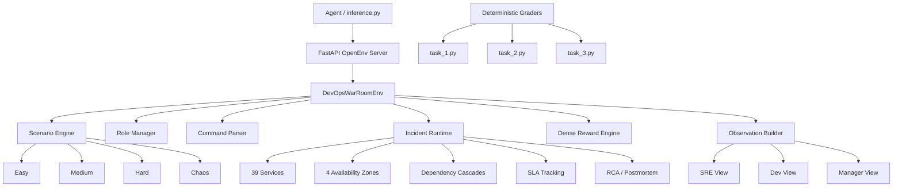
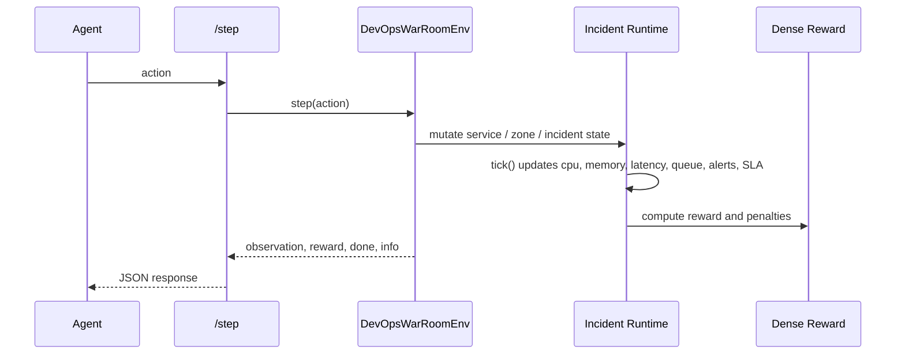

# DevOps War Room

Production incident-response simulator built on OpenEnv. An agent operates as an on-call team member across SRE, Dev, and Manager roles, diagnoses multi-service failures, mitigates outages, verifies SLA recovery, and produces production artifacts such as RCA and postmortems.

**Team:** BholeChature  
**Repository:** https://github.com/KINGKK-007/WarRoom  
**Hugging Face Space:** https://coolalien35-warroom-deploy.hf.space  
**OpenEnv Spec File:** [openenv.yaml](./openenv.yaml)

## Why This Submission Is Real-World

This is not a toy environment. The agent is evaluated on an operational workflow that maps closely to real production response:

- Service failures propagate through a dependency graph of 39 interdependent services.
- Incidents span 4 availability zones with zone drain, failover, and restore behavior.
- Observability is role-filtered and includes metrics, logs, traces, topology, deploy history, and SLA state.
- Recovery is not enough by itself; the agent must also handle runbook attachment, RCA, postmortem generation, and stakeholder communications.
- Deterministic graders validate repaired state and penalize unnecessary restarts or ignored alerts.
- The runtime supports seeded incident variants, procedural chaos incidents, timeline replay, and a browser dashboard.

## Architecture



## Environment Model

### Core loop



### Service topology

- 39 services across data, app, edge, infra, observability, and ops tiers
- 4 zones:
  - `us-east-1a`
  - `us-east-1b`
  - `us-east-1c`
  - `us-central-1a`
- Representative critical services:
  - `postgres-primary`
  - `worker-service`
  - `api-gateway`
  - `frontend-web`
  - `service-mesh`
  - `notification-service`
  - `scheduler-service`
  - `prometheus`
  - `grafana`
  - `tempo`

### Runtime mechanics

- `tick()` updates `cpu`, `memory`, `p99_latency_ms`, `queue_depth`, `error_rate`, `availability`, and saturation.
- Multi-zone cascades propagate through the dependency graph when a core service or zone fails.
- SLA tracking records breach history and can end failed trajectories early.
- Incident timelines capture actions, failures, metric transitions, and SLA breaches for replay.
- RCA output includes blast radius, causal chain, contributing factors, ruled-out causes, and follow-up actions.

## Tasks

The official graded tasks are:

| Task ID | Scenario | Difficulty | Primary Failure Pattern | Success Pattern |
|---|---|---:|---|---|
| `task_1` | Easy | Easy | `postgres-primary` outage cascading into auth/billing | restore DB, verify SLA, create RCA + postmortem |
| `task_2` | Medium | Medium | `worker-service` backlog + zone degradation in `us-east-1b` | drain backlog, heal zone, recover async services |
| `task_3` | Hard | Hard | bad `api-gateway v3.2.1` deploy + zone failure in `us-east-1c` | rollback to `v3.2.0`, fail over, rebalance, restore |

Bonus task:

| Scenario | Difficulty | Description |
|---|---:|---|
| `Chaos` | Advanced | Procedural 5-root-cause incident generation with overlapping service, deploy, and network failures |

Seeded variants are supported through `/reset` with an optional `seed`. Easy, Medium, Hard, and Chaos preserve their task family while varying impacted zones, blast radius, or deploy targets deterministically.

## Action Space

The environment supports 27 meaningful actions. Examples:

| Category | Actions |
|---|---|
| Diagnosis | `inspect`, `query metrics`, `query logs`, `query traces`, `query topology`, `run health check` |
| Service mitigation | `restart service`, `rollback deploy`, `scale`, `clear queue`, `tune autoscaling`, `throttle service`, `isolate service` |
| Zone mitigation | `drain zone`, `failover zone`, `restore zone`, `rebalance traffic` |
| Incident management | `acknowledge alert`, `verify sla`, `run rca`, `generate postmortem`, `attach runbook`, `update status page`, `notify`, `escalate` |
| Coordination | `switch role {SRE|Dev|Manager}` |

## Observation Space

Observations are typed Pydantic objects and are role-filtered.

### Shared fields

- `tick`
- `current_role`
- `services`
- `alerts`
- `zone_health`
- `service_distribution`
- `incident_summary`
- `available_actions`
- `steps_remaining`

### SRE view

- `metrics`
- `logs`
- `traces`
- `metrics_history`

### Dev view

- `deployment_history`
- `code_diffs`
- `logs`
- `traces`

### Manager view

- `sla_status`
- `estimated_affected_users`
- timeline-focused logs

## Reward Design

The reward model is dense, continuous, and explicitly shaped for production response quality.

- Positive signal for evidence collection:
  - inspecting the right service
  - querying metrics, traces, logs, topology, deploy history
- Positive signal for mitigations:
  - correct restart
  - rollback of the bad deploy
  - queue draining and autoscaling
  - zone failover / restore
- Positive signal for production follow-through:
  - SLA verification
  - RCA generation
  - postmortem generation
  - runbook attachment
- Negative signal for:
  - unauthorized actions
  - unknown commands
  - ignored critical alerts
  - unnecessary restarts
  - incomplete or premature RCA/postmortem flows
  - terminal SLA-breach trajectories

## Deterministic Grading

Each official task has a deterministic grader returning a score in `[0.0, 1.0]`.

- [graders/task_1.py](./graders/task_1.py)
- [graders/task_2.py](./graders/task_2.py)
- [graders/task_3.py](./graders/task_3.py)

The graders do not rely on keyword stuffing. They verify:

- final repaired service state
- final metrics such as `error_rate`, `p99_latency_ms`, and `queue_depth`
- required evidence gathered
- required mitigations applied
- SLA verification
- RCA / postmortem completion
- penalties for unnecessary restarts and ignored alerts

## Baseline Results

These are the current baseline scores from [inference.py](./inference.py) against the environment and graders:

| Task | Score | Steps | Outcome |
|---|---:|---:|---|
| `task_1` | `0.97` | 11 | passed with wide margin |
| `task_2` | `1.00` | 16 | perfect normalized score |
| `task_3` | `0.94` | 17 | strong hard-task recovery |

### Adaptive baseline

[adaptive_inference.py](./adaptive_inference.py) is an observation-driven baseline that infers the incident class from live state, branches across seeded variants, and reaches the same grader scores on the three official tasks:

| Task | Adaptive Score | Adaptive Steps |
|---|---:|---:|
| `task_1` | `0.97` | 11 |
| `task_2` | `1.00` | 16 |
| `task_3` | `0.94` | 17 |

### Random vs smart benchmark

Measured with [benchmark.py](./benchmark.py):

| Scenario | Smart Resolved | Smart Error Rate | Random Resolved | Random Error Rate |
|---|---|---:|---|---:|
| Easy | `true` | `0.008` | `false` | `0.015` |
| Medium | `true` | `0.020` | `false` | `0.113` |
| Hard | `true` | `0.008` | `false` | `0.441` |

Observed benchmark runtime:

- `runtime_s = 0.0324`

This matters because it demonstrates the task signal is meaningful: a scripted recovery playbook solves the incidents, while a random agent does not.

## Reproducibility

### Environment variables

| Variable | Purpose | Default |
|---|---|---|
| `API_BASE_URL` | OpenAI-compatible model endpoint | `https://api.groq.com/openai/v1` |
| `MODEL_NAME` | model name for the baseline agent | `llama-3.1-8b-instant` |
| `HF_TOKEN` | API key for the model backend | required |
| `ENV_URL` | target OpenEnv deployment | `https://coolalien35-warroom-deploy.hf.space` |

### Local run

```bash
pip install -r requirements.txt
uvicorn environment.server:app --host 0.0.0.0 --port 8000
```

In another shell:

```bash
export HF_TOKEN="your_token"
export ENV_URL="http://localhost:8000"
python inference.py
```

### Run against Hugging Face Space

```bash
export HF_TOKEN="your_token"
unset ENV_URL
python inference.py
```

`inference.py` defaults to:

```python
ENV_URL = os.environ.get("ENV_URL", "https://coolalien35-warroom-deploy.hf.space")
```

## OpenEnv API

The deployed server exposes:

| Method | Path | Purpose |
|---|---|---|
| `POST` | `/reset` | reset to a specific scenario |
| `POST` | `/step` | execute an action |
| `GET` | `/state` | fetch raw environment state |
| `GET` | `/timeline` | replay structured incident events |
| `GET` | `/health` | health check |
| `GET` | `/metadata` | environment metadata |
| `GET` | `/schema` | action / observation schema |
| `GET` | `/dashboard` | browser dashboard for live topology and timeline |

These endpoints already satisfy the structural OpenEnv REST contract natively:

- `POST /reset`
- `POST /step`
- `GET /state`
- `GET /timeline`
- `GET /health`
- `GET /metadata`

### Quick endpoint checks

```bash
curl -s https://coolalien35-warroom-deploy.hf.space/health
```

```bash
curl -s https://coolalien35-warroom-deploy.hf.space/metadata
```

```bash
curl -s -X POST https://coolalien35-warroom-deploy.hf.space/reset \
  -H "Content-Type: application/json" \
  -d '{"task_id":"Easy"}'
```

```bash
curl -s -X POST https://coolalien35-warroom-deploy.hf.space/reset \
  -H "Content-Type: application/json" \
  -d '{"task_id":"Hard","seed":7}'
```

```bash
curl -s -X POST https://coolalien35-warroom-deploy.hf.space/step \
  -H "Content-Type: application/json" \
  -d '{"action_type":"raw_command","params":{"command":"query metrics"}}'
```

```bash
curl -s https://coolalien35-warroom-deploy.hf.space/timeline
```

```bash
open https://coolalien35-warroom-deploy.hf.space/dashboard
```

## Docker

Build locally:

```bash
docker build -t devops-warroom .
```

Run locally:

```bash
docker run -p 8000:7860 devops-warroom
```

Smoke test:

```bash
curl -s http://localhost:8000/health
```

## Hugging Face Space Deployment

The project is configured for Docker-based Space deployment.

### Publish to a Space remote

```bash
git remote add space https://huggingface.co/spaces/YOUR_USERNAME/warroom-deploy
git push space main
```

### Verify Space health

```bash
curl -s https://YOUR_USERNAME-warroom-deploy.hf.space/health
```

## Validation

### Test suite

```bash
pytest -q
```

Current local result:

- `22 passed`

### Benchmark

```bash
python benchmark.py
```

### OpenEnv validation command

When the OpenEnv CLI is available in your environment, run:

```bash
openenv validate
```

Current status:

- the implementation is validator-aligned by design
- task IDs in [openenv.yaml](./openenv.yaml) match the reset flow used by the baseline agent
- the FastAPI server exposes the expected REST contract
- response serialization explicitly normalizes nested models and enums for JSON safety
- reset supports deterministic seeded variants without changing the task contract

This means the project is likely to pass `openenv validate`, but the final compliance claim should be confirmed by running the actual validator in an environment where the CLI binary is available on `PATH`.

## Repository Layout

```text
WarRoom/
├── environment/
│   ├── actions.py
│   ├── env.py
│   ├── models.py
│   ├── roles.py
│   ├── scenarios.py
│   └── server.py
├── graders/
│   ├── task_1.py
│   ├── task_2.py
│   └── task_3.py
├── tests/
│   ├── conftest.py
│   ├── test_graders.py
│   └── test_system.py
├── benchmark.py
├── inference.py
├── openenv.yaml
├── Dockerfile
└── README.md
```

## Why It Should Score Well

- Real-world utility:
  - models modern production incident response, not a toy domain
- Task + grader quality:
  - 3 official deterministic tasks plus a bonus Chaos scenario
  - dense reward plus exact final-state grading
- Environment design:
  - multi-role, multi-zone, dependency-aware runtime
  - service topology, observability, SLA, RCA, and postmortem flows
- Code quality and deployability:
  - FastAPI server
  - Dockerized Space deployment
  - benchmark and test coverage
- Creativity:
  - overlapping root-cause incidents
  - production artifact generation
  - topology-aware failure recovery
